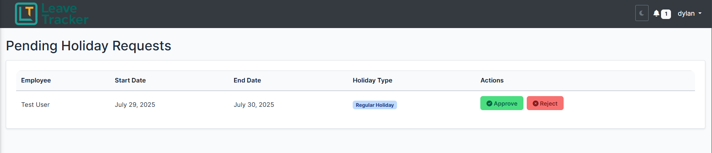

# 🗓️ Team Holiday Calendar App

A Django-based internal web application that allows team members to submit, review, and manage holiday requests — including both regular and special leave types. Designed for small to mid-sized companies seeking lightweight HR leave tracking with approval workflows.

---

## 🚀 Features

### ✅ Core Functionality
- **Submit holiday requests** via a calendar interface
- **Regular and special holidays** (e.g., marriage leave, sick leave. These need to be configured in the admin page)
- **Approval workflow**: managers can approve/reject requests
- **Public holiday awareness** (Integrated with calendarific. Requires to set up a free account to get an API key)
- **Validation**: no overlapping requests, proper date ranges
- **Soft delete support** for history retention
- **Permission system**:
  - Regular employees can request time off
  - Managers can review team requests

### ✉️ Notification System
- Email notifications to line managers and higher roles when a request is submitted
- Employees will be notified via email if their leave request is approved/rejected

### 🧠 Business Rules Enforced
- Weekends and public holidays are excluded automatically
- Requests must not overlap with pending or approved ones from the same person
- Users cannot submit requests if they lack remaining holiday balance
- Every year the leave days are updated with the first log in of the user on the new year

---

## 📦 Tech Stack

- Python 3.10+
- Django 4.x
- SQLite preloaded (can use other DBs like MySQL configuration needs to be added in .env.)
- HTML + Bootstrap (templating)
- Gunicorn (production should be set up with WSGI)
- Optional: pytest + coverage for testing

---

## 🖼️ Screenshots





## 📄 License

This project is licensed under the MIT License - see the [LICENSE](LICENSE) file for details.

## 🛠️ Installation

### 1. Clone the Repo

### 2. Create Virtual Environment

```bash
python -m venv calendar
source calendar/bin/activate  # On Windows: source calendar/Scripts/activate
```

### 3. Install Requirements

```bash
pip install -r requirements.txt
```
- mysqlclient was included in case you want to use a Mysql DB

### 4. Set Up Environment Variables

- The app was configured to use a .env file. So you will be required to create one or set your Django settings module manually. A template of how the .env should look like is also provided in the repos files.

- Update secret keys, database credentials, and email backend settings in `config/settings.py` (or .env).

### 5. Run Migrations

```bash
python manage.py makemigrations
python manage.py migrate
```
### 6. Collectstatic

If you are running the app in a dev environment you are not required to collectstatic because the app uses the whitenoise middleware. However, if you want to release to production you need to remove whitenoise and do the following.

```bash
python manage.py collectstatic
```

### 7. Create Superuser

```bash
python manage.py createsuperuser
```

### 8. Start the App

```bash
python manage.py runserver
```

Access at: http://127.0.0.1:8000/

---

The "python manage.py runserver" should not be used on production level. Use wsgi with gunicorn instead.

## ⚙️ Configuration

### 🔐 Permissions

Permissions are group-based. You must assign the correct permissions via the Django admin:
- `approve_holiday_request`
- `reject_holiday_request`
- `review_holiday_requests_all` / `review_holiday_requests_managed`
- `view_all_employee_holidays`

### 📅 Public Holidays

In order to register and show public holidays in the calendar the app uses calendarific. You can create a free acount there and you will be provided with an API key. You then need to go to LeaveTraker's admin page and create a new Public Holiday fetch config. It will ask you for the api key, the country code and the year. 

Once you click save you will need to click again the configuration you have created to open it. The button "Run Fetch" will now be present. Click it and it will fetch and save the public holidays for that country and year. Change the year and/or country if you want to fetch more.

---

### 🔐 Account creation

In order to create new groups and users you need to go to http://127.0.0.1:8000/admin or your appropirate production url with /admin at the end (make sure you have created a superuser already). There, you will be able to add how many days each user is entitled and assign them in groups for proper permissions. 

Make sure to add the current year when alocating the days in order for the system to know when those days were last checked.

## 🧪 Testing

### Run Tests

Create a pytest.ini file in the root directory with the below

```bash
[pytest]
DJANGO_SETTINGS_MODULE = config.settings
python_files = tests.py test_*.py *_tests.py
```

```bash
 pytest calendarp/tests
```

### Example Areas Covered
- Permission logic
- Holiday submission rules
- Signal-based notifications
- Special holiday validation

---

## ❌ Limitations (Current)

- No formal REST API (Django REST Framework not used) — uses custom JSON endpoints for frontend logic
- No email queuing / async handling
- Not small screen friendly

---

## 📌 Next Steps (Planned)

- ✅ REST API support for SPA/mobile integration
- ✅ Better dashboard views for team leads
- 🔁 Small screen friendly

---

## 🤝 Contributing

This is currently an open source project.

- Send suggestions via issues or pull requests

---

> _This project was built with Django, and hours of coffee-fueled problem-solving._